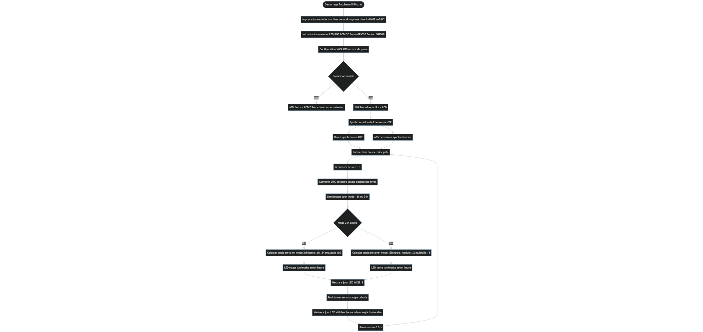

# 🌡️ Projets MicroPython – Raspberry Pi Pico W

Ce dépôt contient **4 programmes**
Chaque programme illustre une étape supplémentaire dans la récupération de données sur internet et sur l'utilisation d'un servo.

---

## 📁 Contenu du dossier

### 1. `ConEtHeure`
➡️ **Description :**  
Connexion à un réseau WiFi + recupération de l'heure et affichage dans le 
**terminal série**.

**Fonctionnalités :**
- Lecture continue de l'heure 
- connexion au wifi
- Rafraîchissement régulier des données  

---

### 2. `ServoTest`
➡️ **Description :**  
Utilisation d'un servo moteur avec des angles de 180 à 0°.

---

## 🕰️ 3. `ServoHeure`

➡️ **Description :**  
Programme de **commande de servo-moteur en fonction de l’heure réelle (NTP)** via le **Raspberry Pi Pico W**.  
Le **servo** simule une **aiguille d’horloge** dont la position varie en fonction de l’heure récupérée sur Internet.  
Le système se connecte automatiquement au **Wi-Fi**, synchronise l’heure grâce à un **serveur NTP**, et met à jour la position du servo toutes les 10 secondes.

---

### ⚙️ Fonctionnalités principales
- 📶 Connexion Wi-Fi automatique  
- 🌐 Synchronisation de l’heure en UTC via **NTP**  
- ⏰ Conversion de l’heure actuelle en **angle de rotation** du servo  
- 🔄 Mise à jour de la position toutes les 10 secondes  

---

### 🧠 Logique du programme

| Élément | Description |
|----------|--------------|
| 🕓 Heure locale | Récupérée avec `time.localtime()` |
| 🔁 Conversion | 12 h = 180°, donc **15° par heure** |
| ⚙️ Servo | Signal PWM à 50 Hz, piloté via `GPIO 20` |
| 🔩 Fonction | `angle_to_duty()` convertit un angle en cycle utile PWM |
| 💡 Exemple | 6h00 → 90°, 12h00 → 180° |

## 🌈 4. `ServoHeureBonus`

➡️ **Description :**  
Programme complet de **visualisation de l’heure locale** via le **Raspberry Pi Pico W**.  
Ce système combine un **servo-moteur**, un **écran LCD I2C (16×2)**, et une **LED RGB WS2812** pour afficher et illustrer le temps de façon dynamique.  
Le code récupère automatiquement l’heure via **NTP**, gère l’**heure d’été/hiver **, et permet de **basculer entre le mode 12h et 24h** grâce à un bouton.

---

### ⚙️ Fonctionnalités principales
- 📶 Connexion Wi-Fi et synchronisation **NTP** automatique  
- 🇫🇷 Gestion de l’**heure d’été/hiver en France**  
- 🕓 Bascule **12h / 24h** via un **bouton poussoir**  
- 💡 Affichage sur **LCD 16×2 I2C** de l’heure, saison et luminosité  
- 🌈 **LED RGB WS2812** dont la couleur et luminosité varient selon l’heure et le mode  
- 🔄 **Servo-moteur** orienté en fonction de l’heure (mode 12h ou 24h)  

---

### 🧠 Logique du programme

| Élément | Description |
|----------|--------------|
| 🕒 Source horaire | Serveur **NTP**, conversion UTC → heure locale |
| ☀️/❄️ Saison | Détection automatique de l’**heure d’été/hiver** |
| 🔘 Bouton | Permet de basculer entre **mode 12h / 24h** |
| 💡 LED RGB | Couleur = mode (rouge = 24h, vert = 12h), luminosité = heure |
| ⚙️ Servo | Positionné en fonction de l’heure locale |
| 🖥️ LCD | Ligne 1 : heure + saison, ligne 2 : angle servo + luminosité |

---

## 🧰 Matériel utilisé

- Raspberry Pi Pico W  
- ServoMoteur 
- Écran LCD 16x2 (I2C)  
- LedRGB W2812
  

